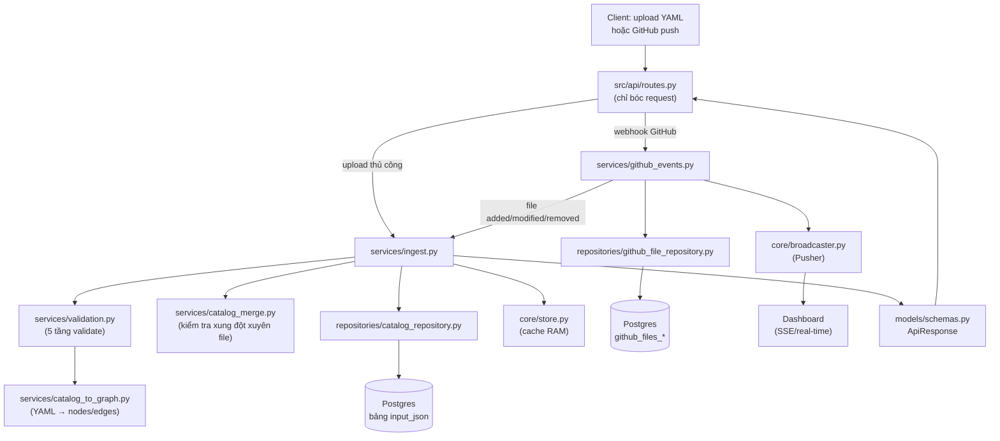

# Cấu trúc dự án & chức năng các thành phần

1. Nhận file YAML (upload tay qua API, hoặc tự động qua **webhook GitHub** khi có push).
2. Chạy **5 tầng validate** (an toàn file → bảo mật → cú pháp → schema → business rule).
3. Biến file hợp lệ thành **graph JSON** (nodes + edges) và lưu vào Postgres.
4. Cho phép liệt kê / tìm kiếm / xoá các catalog đã nạp.
5. Bắn sự kiện real-time (qua Pusher) để dashboard theo dõi tiến độ push GitHub.

Khung `LangGraph agent` trong `src/agents/` là phần **scaffold còn sót lại từ
template gốc** (xem git status: các file này đã bị xoá/không dùng) — chức năng
thật của hệ thống hiện nay nằm ở `src/api`, `src/services`, `src/core`.

---

## Cây thư mục

```text
P-030/
├── src/                            # Toàn bộ mã nguồn backend (FastAPI)
│   ├── main.py                     # 🚀 Điểm khởi động app: tạo FastAPI app, đăng ký
│   │                                #    middleware, exception handler, mount router,
│   │                                #    endpoint /health và / (root)
│   │
│   ├── api/                        # 🌐 TẦNG API — nơi DUY NHẤT định nghĩa HTTP route
│   │   ├── __init__.py
│   │   └── routes.py                #    Toàn bộ endpoint nghiệp vụ, prefix /catalogs:
│   │                                #    - POST   /catalogs             upload 1..N file YAML
│   │                                #    - GET    /catalogs             danh sách catalog đã nạp
│   │                                #    - DELETE /catalogs/{filename}  xoá 1 catalog
│   │                                #    - POST   /catalogs/webhook/github   nhận push GitHub
│   │                                #    - GET    /catalogs/webhook/events   kênh SSE real-time
│   │                                #    Route KHÔNG chứa business logic — chỉ bóc tách
│   │                                #    request rồi gọi thẳng xuống src/services/*
│   │
│   ├── core/                       # ⚙️ Hạ tầng dùng chung, không chứa nghiệp vụ
│   │   ├── config.py                #    Toàn bộ Settings (Pydantic) + hằng số ngưỡng an
│   │                                #    toàn (giới hạn size file, số dòng YAML, v.v.)
│   │   ├── db.py                    #    Kết nối Postgres (SQLAlchemy), init schema/bảng
│   │   ├── store.py                 #    Cache RAM của bảng input_json (tăng tốc GET/list,
│   │                                #    và dùng để kiểm tra xung đột giữa các file)
│   │   ├── broadcaster.py           #    Gửi sự kiện real-time qua Pusher (thay SSE giữ
│   │                                #    kết nối — phù hợp môi trường serverless/Vercel)
│   │   ├── logging.py               #    Cấu hình log + request_id để nối các dòng log
│   │                                #    của cùng một request
│   │   └── errors.py                #    Cây exception dùng chung: ValidationError (422),
│   │                                #    SecurityError (400), CriticalError (500),
│   │                                #    HumanReviewRequiredError (409)
│   │
│   ├── models/                     # 📋 Định nghĩa "hình dạng dữ liệu"
│   │   ├── schemas.py                #    Pydantic models cho request/response API
│   │                                #    (ApiResponse — hợp đồng response DUY NHẤT cho
│   │                                #    mọi endpoint; CatalogSummary; Issue...)
│   │   ├── tables.py                 #    SQLAlchemy ORM — mô tả bảng Postgres thật sự
│   │                                #    (input_json, github_files_added/modified/removed)
│   │   └── events.py                 #    Hình dạng sự kiện SSE/Pusher (push_started,
│   │                                #    file_result, push_completed)
│   │
│   ├── repositories/               # 🗄️ Tầng DUY NHẤT chạm SQLAlchemy trực tiếp
│   │   ├── catalog_repository.py     #    CRUD bảng input_json (save/find/delete/list)
│   │   └── github_file_repository.py #    Ghi log 3 bảng github_files_{added,modified,removed}
│   │
│   ├── services/                   # 🔧 TẦNG NGHIỆP VỤ — nơi "biết thứ tự các bước"
│   │   ├── ingest.py                 #    Điều phối nạp 1 catalog: validate → check xung
│   │                                #    đột → lưu DB → cập nhật cache → dựng response.
│   │                                #    Được gọi bởi cả route upload thủ công LẪN webhook.
│   │   ├── validation.py             #    Pipeline validate 5 tầng (Layer 1→5), fail-fast:
│   │                                #    L1 input cơ bản, L2 bảo mật (YAML bomb, tag độc,
│   │                                #    file giả dạng), L3 cú pháp YAML/encoding, L4 schema,
│   │                                #    L5 business rule (ref hợp lệ, chu trình phụ thuộc...)
│   │   ├── catalog_to_graph.py       #    "Trái tim" thuật toán: parse 1 file YAML →
│   │                                #    nodes/edges (đồ thị phụ thuộc), định nghĩa toàn
│   │                                #    bộ luật schema (slug, ref, owners, topology...)
│   │   ├── catalog_merge.py          #    Gộp nhiều ParsedFile thành 1 graph tổng — phát
│   │                                #    hiện xung đột sở hữu, cạnh mồ côi, chu trình
│   │                                #    phụ thuộc XUYÊN NHIỀU FILE
│   │   └── github_events.py          #    Xử lý webhook GitHub: xác thực HMAC → bóc tách
│   │                                #    payload push → tải nội dung file qua GitHub API →
│   │                                #    băm SHA-256 & ghi log → gọi ingest/delete tương ứng
│   │
│   └── agents/                     # 🧠 (KHÔNG dùng — scaffold LangGraph còn sót từ
│                                    #    template gốc, đã bị xoá khỏi git working tree)
│
├── tests/                          # 🧪 Bộ test pytest
│   ├── conftest.py                   #    Fixture dùng chung (DB test, TestClient...)
│   ├── test_api/test_routes.py       #    Test các endpoint trong src/api/routes.py
│   ├── test_agents/test_graph.py     #    Test còn sót từ scaffold agent
│   ├── test_broadcaster.py           #    Test EventBroadcaster (Pusher)
│   ├── test_catalog_api.py           #    Test luồng ingest/list/delete catalog end-to-end
│   └── test_webhook_events.py        #    Test luồng webhook GitHub + sự kiện SSE
│
├── data/                           # 📦 File catalog-info.yaml mẫu để test/demo tay
│   └── *.catalog.yaml
│
├── scripts/                        # 🔌 Tiện ích vận hành & AI-usage logging (không phải API)
│   ├── log_hook.py, log_manual.py, log_antigravity.py, submit_log.py
│   ├── setup_hooks.sh / .ps1         #    Cài hook log prompt AI (Claude/Cursor/Copilot...)
│   ├── simulate_push.py              #    Giả lập 1 request webhook GitHub để test tay
│   └── test_api.py                   #    Script gọi thử API thủ công
│
├── docs/                           # 📖 Tài liệu
│   ├── PRD.md, BRIEF.md, UI_FLOW.md  #    Yêu cầu sản phẩm / luồng UI
│   ├── architecture_diagram.md       #    Sơ đồ kiến trúc (mermaid) — bản gốc từ template,
│   │                                #    mô tả kiến trúc LangGraph agent chưa cập nhật
│   │                                #    theo hệ thống catalog thực tế
│   └── guide/                        #    Technical guidebook 10 chương (tài liệu học AI20K)
│
├── eval/results/report.md          # 📊 Kết quả đánh giá (evaluation) nếu có
├── presentation/                   # 🎤 Slide Demo Day
│
├── Dockerfile                      # 🐳 Build multi-stage, chạy `uvicorn src.main:app`
├── docker-compose.yml              # 🐙 Orchestration (app + Postgres...) cho local/dev
├── vercel.json                     # ☁️ Cấu hình deploy serverless lên Vercel
├── requirements.txt                # 📌 Danh sách dependency Python
├── ruff.toml                       # 🧹 Cấu hình linter Ruff
└── Makefile                        # 🛠️ Lệnh tắt (make run, make test, ...)
```

---

## Nhánh `src/api/` — chi tiết từng endpoint

`src/api/routes.py` là **cổng vào duy nhất** của mọi request nghiệp vụ. Router có
`prefix="/catalogs"` và được mount vào app ở `src/main.py` với thêm tiền tố
`/api/v1` → toàn bộ endpoint thực tế nằm dưới `/api/v1/catalogs/...`.

Nguyên tắc thiết kế: **route không chứa business logic**. Route chỉ làm 3 việc —
đọc request (file, header, query param) → gọi đúng hàm service → trả về
`ApiResponse`. Toàn bộ "biết phải làm gì, theo thứ tự nào" nằm ở `src/services/`.

| Method & Path                     | Hàm xử lý               | Gọi xuống                               | Mô tả                                                                                                                                                                                                                                                                                                   |
| --------------------------------- | -------------------------- | ----------------------------------------- | --------------------------------------------------------------------------------------------------------------------------------------------------------------------------------------------------------------------------------------------------------------------------------------------------------- |
| `POST /catalogs`                | `upload_catalogs`        | `services.ingest.ingest_catalogs_batch` | Nhận 1..N file YAML từ form-data, đọc bytes, đưa xuống service chạy pipeline validate 5 tầng cho từng file. Một file lỗi không chặn các file còn lại — chỉ lỗi hệ thống (`CriticalError`) mới dừng cả batch.                                                                   |
| `GET /catalogs`                 | `list_catalogs`          | `services.ingest.list_catalogs`         | Liệt kê catalog đã nạp (đọc từ cache RAM`core.store`), hỗ trợ tìm theo tên (`?q=`) và lấy kèm chi tiết cảnh báo (`?include=diagnostics`).                                                                                                                                         |
| `DELETE /catalogs/{filename}`   | `delete_catalog`         | `services.ingest.delete_catalog`        | Xoá 1 catalog: xoá dòng trong bảng`input_json` trước, xoá cache sau (đảm bảo không có bản ghi "mồ côi" nếu DB lỗi giữa chừng).                                                                                                                                                       |
| `POST /catalogs/webhook/github` | `github_webhook_handler` | `services.github_events`                | Endpoint GitHub gọi mỗi khi có`push`. Xác thực chữ ký HMAC-SHA256 trên body thô, bóc tách payload, rồi gọi `handle_push` để tự động nạp file `added`/`modified` và xoá file `removed`. Luôn trả HTTP 200 kể cả khi 1 file YAML sai, để GitHub không retry vô ích. |
| `GET /catalogs/webhook/events`  | `github_webhook_events`  | `core.broadcaster`                      | Kênh Server-Sent Events cho dashboard theo dõi tiến độ xử lý push theo thời gian thực (`push_started`, `file_result`, `push_completed`). Không lọc theo user — mọi client kết nối đều thấy mọi sự kiện.                                                                        |

### Sơ đồ luồng dữ liệu



### Vì sao tách nhiều lớp như vậy?

- **`api/` (route)**: chỉ biết HTTP. Không biết validate, không biết DB.
- **`services/` (nghiệp vụ)**: biết *thứ tự* các bước (validate → check xung đột →
  lưu → cập nhật cache → dựng response). Đây là nơi duy nhất nên sửa nếu muốn
  thêm bước mới (ví dụ gọi thêm 1 service khác sau khi lưu).
- **`repositories/` (dữ liệu)**: tầng duy nhất import SQLAlchemy. Đổi từ Postgres
  sang DB khác chỉ cần sửa 2 file trong thư mục này.
- **`core/` (hạ tầng)**: config, lỗi, log, cache, broadcast — dùng chung cho mọi
  tầng ở trên, không chứa logic nghiệp vụ riêng của "catalog".
- **`models/` (hợp đồng dữ liệu)**: `schemas.py` là hợp đồng với frontend,
  `tables.py` là hợp đồng với Postgres — tách riêng vì đổi vì hai lý do khác nhau.

### Response contract chung (`ApiResponse`)

Mọi endpoint — dù thành công, cảnh báo hay lỗi — đều trả về **cùng một hình dạng
JSON** (`src/models/schemas.py::ApiResponse`), gồm: `status`, `severity`, `code`,
`message`, `can_continue`, `next_action`, `stage`, `request_id`, `issues[]`,
`details{}`. Nhờ vậy frontend chỉ cần viết **một** hàm xử lý response dùng chung
cho toàn bộ API, không phải đoán mỗi endpoint trả kiểu gì.
