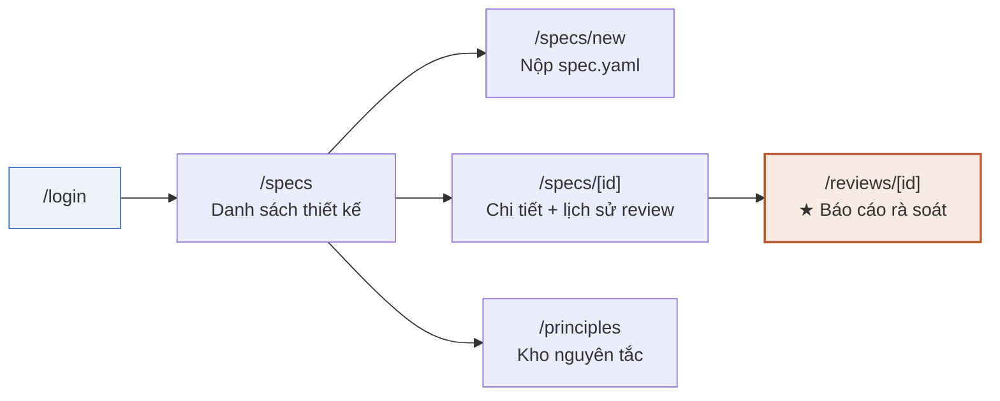
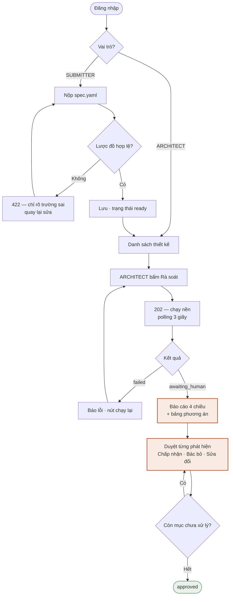

# UI Flow & Wireframe — P-030

React.js + Tailwind + shadcn/ui.

---

## 1. Sitemap



## 2. User flow



---

## 3. Wireframe

### 3.1 `/specs` — Danh sách thiết kế

```
┌──────────────────────────────────────────────────────────────────────┐
│  P-030  Arch Review          Thiết kế   Nguyên tắc      khua ▾       │
├──────────────────────────────────────────────────────────────────────┤
│                                                                      │
│  Thiết kế đã nộp                              [ + Nộp spec.yaml ]    │
│                                                                      │
│  ┌────────────────────────────────────────────────────────────────┐  │
│  │ Tên dịch vụ      Ngày nộp    Trạng thái       Xác minh   Action│  │
│  ├────────────────────────────────────────────────────────────────┤  │
│  │ order-service    01/08 14:2  ● Chờ duyệt        97%     [Xem]  │  │
│  │ v1.2                          8/14 đã xử lý                    │  │
│  ├────────────────────────────────────────────────────────────────┤  │
│  │ notify-service   31/07 09:1  ✓ Đã duyệt         100%    [Xem]  │  │
│  ├────────────────────────────────────────────────────────────────┤  │
│  │ payment-gw       31/07 08:0  ○ Chưa rà soát      —    [Rà soát]│  │
│  │ v0.9                                                    ARCH   │  │
│  └────────────────────────────────────────────────────────────────┘  │
└──────────────────────────────────────────────────────────────────────┘
```

- Nút `Rà soát` **chỉ hiện với ARCHITECT**
- Trạng thái rỗng: minh hoạ + nút nộp file + link tới file mẫu
- Đang tải: `<Skeleton />` 3 dòng

### 3.2 `/specs/new` — Nộp thiết kế

```
┌──────────────────────────────────────────────────────────────────────┐
│  ← Quay lại                                                          │
│                                                                      │
│  Nộp bản thiết kế                                                    │
│                                                                      │
│  ┌──────────────────────────────────────────────────────────────┐    │
│  │                                                              │    │
│  │              Kéo thả spec.yaml vào đây                       │    │
│  │              hoặc  [ Chọn file ]                             │    │
│  │                                                              │    │
│  │              .yaml · tối đa 1 MB                             │    │
│  └──────────────────────────────────────────────────────────────┘    │
│                                                                      │
│  📄 Tải file mẫu có chú thích    📖 Xem lược đồ spec.yaml            │
│                                                                      │
│  ─── Sau khi chọn file ───────────────────────────────────────────   │
│                                                                      │
│  ✗ Lược đồ không hợp lệ — 2 lỗi                                      │
│    ┌──────────────────────────────────────────────────────────┐      │
│    │ components[0].replicas    thiếu trường bắt buộc          │      │
│    │ context.sla.p95_latency   phải là số, nhận được "300ms"  │      │
│    └──────────────────────────────────────────────────────────┘      │
│                                       [ Sửa và thử lại ]             │
└──────────────────────────────────────────────────────────────────────┘
```

Validate ngay khi chọn file, **trước khi gửi lên server** — lỗi lược đồ không tốn một token nào.

### 3.3 `/reviews/[id]` — Đang chạy

```
┌──────────────────────────────────────────────────────────────────────┐
│  order-service v1.2                                    ⟳ Đang rà soát│
│                                                                      │
│  ████████████████████░░░░░░░░░░░░  8/13 node        ~35 s còn lại    │
│                                                                      │
│  ✓ load_spec              ✓ validate_schema      ✓ flatten_paths     │
│  ✓ derive_metrics         ✓ rule_engine          ✓ retrieve_princ.   │
│  ⟳ review_security   ⟳ review_cost   ⟳ review_avail   ⟳ review_scal  │
│  ○ verify_grounding       ○ generate_options     ○ compose_report    │
│                                                                      │
│  ┌────────────────────────────────────────────────────────────────┐  │
│  │  ░░░░░░░░░░░░░░░░░░░░  skeleton  ░░░░░░░░░░░░░░░░░░░░░░░░░░░░  │  │
│  └────────────────────────────────────────────────────────────────┘  │
└──────────────────────────────────────────────────────────────────────┘
```

Tên node lấy từ bảng `agent_runs`. Biến 60 giây chờ thành quá trình quan sát được — vừa đỡ sốt ruột, vừa cho người chấm thấy bên trong hệ thống đang làm gì.

### 3.4 `/reviews/[id]` — Báo cáo (màn hình chính)

```
┌──────────────────────────────────────────────────────────────────────────────┐
│ order-service v1.2 · 74s · $0.031 · Đã xác minh 97%      [Xuất báo cáo ▾]     │
│ ████████░░░░░░░  Đã xử lý 8/14                                               │
├───────────────────────────────────┬──────────────────────────────────────────┤
│  Bảo mật(4) Sẵn sàng(5) Mở rộng(3)│  spec.yaml                               │
│  Chi phí(2)                       │                                          │
│                                   │   11  components:                        │
│  ┌─────────────────────────────┐  │   12    - id: api-gateway                │
│  │🔴 CRITICAL  AV-01     ⚙luật │  │   13      type: gateway                  │
│  │ API Gateway 1 bản sao,      │  │ ▸ 14      replicas: 1        ◀━━━━━━━━━┓ │
│  │ không có dự phòng           │  │   15      availability_zones:          ┃ │
│  │ components[0].replicas = 1  │──┼───────────────────────────────────────━┛ │
│  │ kỳ vọng: >= 2               │  │   16        - ap-southeast-1a            │
│  ├─────────────────────────────┤  │   17      stateful: true                 │
│  │  Lý do                      │  │   18                                     │
│  │  Toàn bộ lưu lượng đi qua…  │  │   19  datastores:                        │
│  │                             │  │   20    - id: main-db                    │
│  │  📘 ARC-AVL-002  MUST       │  │                                          │
│  │  Dịch vụ hướng người dùng   │  │                                          │
│  │  phải có ≥ 2 bản sao        │  │                                          │
│  │                             │  │                                          │
│  │  Phương án khắc phục        │  │                                          │
│  │  ┌───────────┬────┬───┬───┐ │  │                                          │
│  │  │           │$/th│ms │mở │ │  │                                          │
│  │  ├───────────┼────┼───┼───┤ │  │                                          │
│  │  │A 2 bản/1AZ│ +20│ 0 │3/5│ │  │                                          │
│  │  │B 2 bản/2AZ│ +62│+2 │5/5│ │  │                                          │
│  │  │  ◆ khuyến │    │   │   │ │  │                                          │
│  │  │C Managed  │+45…│+5 │5/5│ │  │                                          │
│  │  └───────────┴────┴───┴───┘ │  │                                          │
│  │  ◆ B đạt SLA 99.9% và rẻ    │  │                                          │
│  │    nhất trong nhóm đạt SLA. │  │                                          │
│  │    Kèm điều kiện: xử lý     │  │                                          │
│  │    cùng SC-01.              │  │                                          │
│  │                             │  │                                          │
│  │ [✓ Chấp nhận][✗ Bác bỏ][⏸] │  │                                          │
│  │ ┌─────────────────────────┐ │  │                                          │
│  │ │ Ghi chú…                │ │  │                                          │
│  │ └─────────────────────────┘ │  │                                          │
│  └─────────────────────────────┘  │                                          │
│                                   │                                          │
│  ┌─────────────────────────────┐  │                                          │
│  │🟠 HIGH  SE-02        ✓ khua │  │                                          │
│  │ main-db không mã hoá at rest│  │                                          │
│  │ Đã chấp nhận · 01/08 15:12  │  │                                          │
│  └─────────────────────────────┘  │                                          │
│                                   │                                          │
│  ▸ Cần kiểm chứng thủ công (1)    │                                          │
└───────────────────────────────────┴──────────────────────────────────────────┘
```

**Chi tiết cần đúng:**

| Yếu tố | Quy tắc |
|---|---|
| Tỉ lệ cột | 40% trái / 60% phải |
| Click phát hiện | Cột phải cuộn tới `line`, highlight dòng, giữ 2 giây rồi nhạt dần |
| Nhãn nguồn | `⚙ luật` (rule engine) hoặc `🤖 mô hình` — cho biết độ tin cậy |
| Màu severity | critical `#B85A34` · high `#C08A2E` · medium `#96762A` · low xám |
| Đã quyết định | Card mờ 60%, hiện tên người + thời điểm, thu gọn |
| Chưa xác minh | Nhóm riêng cuối danh sách, có accordion, mặc định đóng |
| Nút quyết định | Ẩn hoàn toàn với SUBMITTER |

### 3.5 `/principles` — Kho nguyên tắc

```
┌──────────────────────────────────────────────────────────────────────┐
│  Nguyên tắc kiến trúc nội bộ                            20 mục       │
│                                                                      │
│  Phân loại: [Tất cả ▾]    Mức: [Tất cả ▾]    🔍 Tìm…                │
│                                                                      │
│  ┌────────────────────────────────────────────────────────────────┐  │
│  │ ARC-AVL-002   MUST    Độ sẵn sàng                              │  │
│  │ Dịch vụ hướng người dùng phải chạy tối thiểu hai bản sao       │  │
│  │ Nguồn: Azure WAF — Reliability (biên soạn lại)          [▾]    │  │
│  ├────────────────────────────────────────────────────────────────┤  │
│  │ ARC-SEC-003   MUST    Bảo mật                                  │  │
│  │ Dữ liệu nhạy cảm phải mã hoá khi lưu                    [▾]    │  │
│  └────────────────────────────────────────────────────────────────┘  │
└──────────────────────────────────────────────────────────────────────┘
```

Mở rộng → nội dung đầy đủ, ví dụ vi phạm, ví dụ tuân thủ.

---

## 4. Trạng thái và trường hợp biên

| Tình huống | Xử lý trên UI |
|---|---|
| Chưa có thiết kế nào | Minh hoạ + nút nộp + link file mẫu |
| Đang tải dữ liệu | `<Skeleton />`, không dùng spinner toàn trang |
| YAML sai lược đồ | Danh sách lỗi kèm đường dẫn trường, validate phía client trước |
| Review `failed` | Banner đỏ, thông báo đọc được, nút Chạy lại |
| Tài liệu không có phát hiện nào | Thẻ xanh "Không tìm thấy rủi ro" + nhắc kiểm tra thủ công |
| SUBMITTER mở review | Thấy toàn bộ nội dung, không thấy nút quyết định |

## 5. Component (shadcn/ui)

`Button` `Card` `Table` `Badge` `Dialog` `Tabs` `Accordion` `Input` `Textarea` `Label` `Skeleton` `Sonner` `Progress` `Tooltip` `DropdownMenu`

Ngoài ra: `react-markdown` (nội dung nguyên tắc) · `shiki` hoặc `prism` (tô màu YAML) · `@tanstack/react-query` (polling 3 giây)

## 6. Responsive

Thiết kế cho desktop trước — người dùng thật rà soát trên màn hình lớn.

- `≥ 1280px` — hai cột 40/60
- `768–1279px` — hai cột 50/50, thu gọn sidebar
- `< 768px` — một cột, YAML nằm trong `Sheet` trượt lên khi click phát hiện
